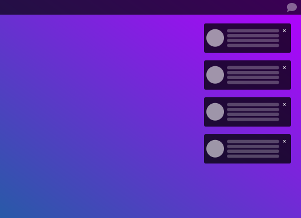

# Notification Area

The notification area is located at the right end of the screen that you can show using panel button.
It provides notifications about things like incoming email, updates, and network connectivity.

made by Fernando Moreira, [Twitter](https://twitter.com/nando_ferreira2) and [Reddit](https://www.reddit.com/user/zisongbr)

# Reporting issues
Issues should be reported to the Github https://github.com/fer-moreira/notification-area/issues.

# TODO

- blur effect
- better notification easing animation
- better integration with gnome-shell
- buttons "Clear" and "Do not Disturb"
- custom buttons
- fix erros with dual monitor
